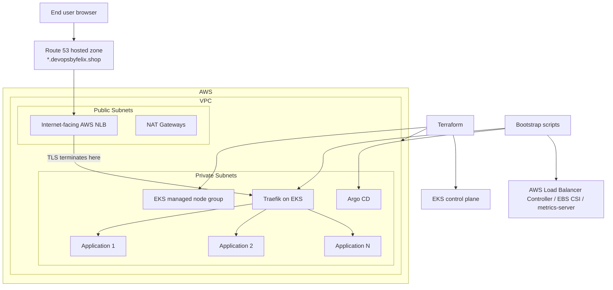

# AWS VPC + EKS Infrastructure for a GitOps Demo Platform

This repository provisions the **base AWS infrastructure** for my DevOps portfolio platform. It creates the VPC, Amazon EKS cluster, supporting AWS resources, and the initial cluster add-ons needed to host internet-facing applications.

The wider portfolio is split into three repositories:

- **infra** — AWS networking, EKS, and cluster bootstrap  
  `https://github.com/felixngwhuk/opentelemetry-devops-demo-infra`
- **web app** — application source code and container images  
  `https://github.com/felixngwhuk/opentelemetry-devops-demo`
- **gitops** — Argo CD application definitions and deployment manifests  
  `https://github.com/felixngwhuk/opentelemetry-devops-demo-gitops`

This repo focuses on the **platform foundation**: creating a reusable AWS environment and preparing the cluster for GitOps-based application delivery.

---

## Skills demonstrated by this repository

This repository demonstrates practical platform engineering work across:

- Terraform and Infrastructure as Code
- AWS networking and Amazon EKS
- Kubernetes cluster bootstrap
- Ingress and public traffic flow design
- GitOps platform enablement with Argo CD
- Operational automation and environment trade-offs

---

## What this repository does

This project provisions and bootstraps:

- a custom **AWS VPC** with public and private subnets across multiple Availability Zones
- an **Amazon EKS** cluster with a managed node group
- **remote Terraform state** stored in S3
- cluster add-ons required for ingress, storage, metrics, and GitOps
- **Traefik** as the in-cluster ingress controller
- **Argo CD** as the GitOps entry point for application deployment

The goal of this repository is not only to create an EKS cluster, but to show **how I structure the platform layer first** before deploying workloads.

---

## Why I took this approach

I split the platform into separate repositories because each layer has a different responsibility:

- the **infra repo** creates the AWS foundation
- the **web app repo** contains the application code and image build logic
- the **gitops repo** defines what should run in the cluster

I chose this structure because it makes the project easier to understand and closer to how responsibilities are often separated in real delivery workflows.

Within this infra repo, I used:

- **Terraform** to provision AWS resources consistently and repeatably
- **modular Terraform** so networking and EKS logic are easier to reason about and extend
- **bootstrap scripts** for cluster add-ons because some post-cluster steps are operational tasks rather than core infrastructure resources
- **Traefik** to provide simple hostname-based routing for multiple demo applications
- **Argo CD** so application deployment can be managed through GitOps rather than manual kubectl apply workflows

---

## Skills and topics covered in detail

### Infrastructure as Code
I used Terraform to define the AWS foundation because I wanted the environment to be reproducible rather than manually configured. This includes:

- modular Terraform for **VPC** and **EKS**
- remote state stored in **S3**
- parameterised values for region, CIDR ranges, Availability Zones, Kubernetes version, and node sizing

### AWS networking and platform setup
I created a dedicated VPC layout because I wanted public access to enter through load balancers while keeping worker nodes in private subnets. This includes:

- public and private subnets across multiple AZs
- Internet Gateway and NAT Gateways
- route tables and subnet tagging for Kubernetes load balancer integration
- EKS control plane logging support

### Kubernetes platform bootstrap
I added cluster bootstrap scripts because creating the cluster is only the first step; it still needs operational components before it can host applications. This includes:

- AWS Load Balancer Controller
- AWS EBS CSI Driver
- metrics-server
- Traefik
- Argo CD

### Ingress and public access design
I used Traefik plus an AWS network load balancer because I wanted a simple way to expose multiple applications through subdomains while keeping routing logic inside the cluster.

### Operational thinking
I added helper scripts and bootstrap logging because even for a demo environment, setup and teardown should be repeatable and easier to troubleshoot.

---

## Architecture overview

### High-level flow

1. Terraform provisions the VPC, subnets, routing, IAM roles, EKS cluster, and related AWS resources.
2. After the cluster is available, shell scripts install the required platform add-ons.
3. Traefik is exposed through a Kubernetes `Service` of type `LoadBalancer`.
4. AWS Load Balancer Controller provisions an **internet-facing Network Load Balancer (NLB)** for that service.
5. Public DNS for `*.devopsbyfelix.shop` is managed through **Route 53**.
6. A certificate is **issued by AWS ACM** for the domain.
7. **TLS termination happens on the NLB**, and the request is then forwarded to Traefik over HTTP.
8. Traefik applies hostname/path routing rules and forwards the request to the target application in the cluster.
9. Argo CD connects the cluster to the separate GitOps repository for application delivery.

### Architecture diagram



---

## Repository structure

```text
.
├── aws-infra/
│   ├── terraform-state-s3-bucket/
│   │   ├── main.tf
│   │   └── outputs.tf
│   └── vpc-eks/
│       ├── main.tf
│       ├── variables.tf
│       ├── outputs.tf
│       └── modules/
│           ├── vpc/
│           │   ├── main.tf
│           │   ├── variables.tf
│           │   └── outputs.tf
│           └── eks/
│               ├── main.tf
│               ├── variables.tf
│               └── outputs.tf
├── eks-cluster/
│   ├── eks-cluster-init.sh
│   ├── eks-cluster-teardown.sh
│   └── scripts/
│       ├── associate-iam-oidc-provider.sh
│       ├── create_iam_role_and_eks_serviceaccount.sh
│       ├── install_alb_controller.sh
│       ├── install_ebs_csi_driver.sh
│       ├── install_metrics_server.sh
│       ├── install_traefik.sh
│       ├── install_traefik_custom_values.yaml
│       ├── install_argocd.sh
│       ├── install_argocd_custom_values.yaml
│       ├── refresh_eks_cluster_connection.sh
│       └── traefik-pdb.yaml
└── utilities/
    └── scripts/
        ├── cleanup-unused-oidc-providers.sh
        └── purge_versioned_bucket.sh
```

---

## Key design decisions

### Decision: Use Terraform modules for VPC and EKS
**Why I did this:** I wanted the networking layer and the cluster layer to stay separate so the project is easier to navigate and change later.

### Decision: Keep worker nodes in private subnets
**Why I did this:** I wanted external traffic to enter through managed AWS load balancers rather than exposing Kubernetes nodes directly to the internet.

### Decision: Use S3 remote state with S3 lockfile-based locking
**Why I did this:** I wanted shared Terraform state in AWS instead of local state files, and I chose the S3 backend lockfile approach because it is the current direction for the S3 backend.

### Decision: Use Traefik as the in-cluster ingress controller
**Why I did this:** I wanted one routing layer inside Kubernetes that can expose multiple demo applications through subdomains without adding too much operational complexity.

### Decision: Use Argo CD for deployment bootstrap
**Why I did this:** I wanted the infrastructure layer and the application deployment layer to remain separate. Once the cluster is ready, application rollout can be managed from the GitOps repository instead of applying manifests manually.

### Decision: Terminate TLS on the AWS NLB
**Why I did this:** I wanted certificate management to stay on the AWS side while keeping Traefik focused on HTTP routing inside the cluster.

---

## Provisioned infrastructure

### 1) Terraform state bootstrap
The `terraform-state-s3-bucket` project creates the S3 bucket used for Terraform state storage.

I set this up first because remote state is part of the platform foundation, not something I wanted to add later after resources already existed.

### 2) AWS networking
The VPC module creates:

- the VPC
- public and private subnets
- Internet Gateway
- NAT Gateways
- public and private route tables
- Kubernetes-related subnet tags

I chose this layout because EKS needs clear separation between public entry points and private workload placement.

### 3) Amazon EKS
The EKS module creates:

- the EKS control plane
- IAM roles for cluster and nodes
- a managed node group
- control plane logging resources

I used EKS managed nodes because they reduce the amount of low-level cluster administration needed for a demo platform.

### 4) Cluster bootstrap
The bootstrap scripts install and configure:

- AWS Load Balancer Controller
- AWS EBS CSI Driver
- metrics-server
- Traefik
- Argo CD

I handled these after cluster creation because they depend on a working Kubernetes API and, in some cases, on IAM/OIDC integration already being available.

---

## Public traffic flow

Applications on this platform are intended to be accessed using subdomains such as:

- `app.devopsbyfelix.shop`
- `argocd.devopsbyfelix.shop`
- `demo.devopsbyfelix.shop`

Traffic path:

```text
User -> Route 53 -> AWS NLB -> TLS terminates on the NLB -> Traefik -> target Kubernetes service -> application pod
```

Why I chose this design:

- I wanted **DNS** to stay in Route 53 because the project domain is hosted in AWS.
- I wanted **certificate issuance** to be handled by AWS ACM.
- I wanted **TLS termination** to happen at the NLB so Traefik can focus on in-cluster routing.
- I wanted **Traefik** to remain the central routing layer for multiple applications.

Important implementation detail:

- The AWS Load Balancer Controller provisions the external load balancer based on the Kubernetes `Service` annotations on Traefik.
- In this setup, that external load balancer is an **NLB**.
- Traefik then forwards the request to the correct workload inside the cluster.

---

## Tooling used

- **Terraform** for AWS infrastructure provisioning
- **AWS CLI** for AWS access and cluster queries
- **kubectl** for Kubernetes management
- **eksctl** for OIDC and IAM service account operations
- **Helm** for installing cluster add-ons
- **Argo CD** for GitOps application delivery
- **Traefik** for ingress and routing

---

## Prerequisites

To run this project, you need:

- an AWS account
- AWS credentials configured locally
- Terraform installed
- kubectl installed
- Helm installed
- eksctl installed
- a Route 53 hosted zone for the target domain
- an ACM certificate for the target domain

---

## How to use this repository

### 1) Create the Terraform state bucket
Create the S3 bucket used for Terraform state first.

### 2) Provision the VPC and EKS cluster
Run Terraform in the `aws-infra/vpc-eks` project.

### 3) Refresh kubeconfig / cluster access
Use the refresh script so local tooling can connect to the new EKS cluster.

### 4) Bootstrap cluster add-ons
Run the cluster init script to install the required components.

### 5) Connect the GitOps repo
Once Argo CD is available, use the separate GitOps repository to deploy workloads into the cluster.

---

## Demo Compromises vs Production

### 1) Single demo cluster for multiple workloads
**What I am simplifying:** Using one cluster to host several demo applications.  
**Why:** Lower cost and simpler management.  
**Risk introduced:** Lower isolation between workloads and environments.  
**What production would look like:** Separate environments, tighter tenancy boundaries, and stronger policy controls.

### 2) Scripted bootstrap for add-ons
**What I am simplifying:** Installing several add-ons with shell scripts after Terraform completes.  
**Why:** Keeps the initial platform bootstrap easier to understand and debug.  
**Risk introduced:** More orchestration logic sits outside Terraform.  
**What production would look like:** More standardised bootstrapping, stronger CI orchestration, and clearer promotion between environments.

### 3) Static ACM certificate reference in Traefik values
**What I am simplifying:** The ACM certificate ARN is currently referenced statically in the Traefik values file.  
**Why:** It is the fastest way to get the NLB listener configured during a demo.  
**Risk introduced:** Less portability between accounts or regions, and more manual change when the certificate changes.  
**What production would look like:** Inject the ARN dynamically from Terraform outputs, templating, or environment-specific configuration.

---

## Related repositories

- Infra: `https://github.com/felixngwhuk/opentelemetry-devops-demo-infra`
- Web app: `https://github.com/felixngwhuk/opentelemetry-devops-demo`
- GitOps: `https://github.com/felixngwhuk/opentelemetry-devops-demo-gitops`
