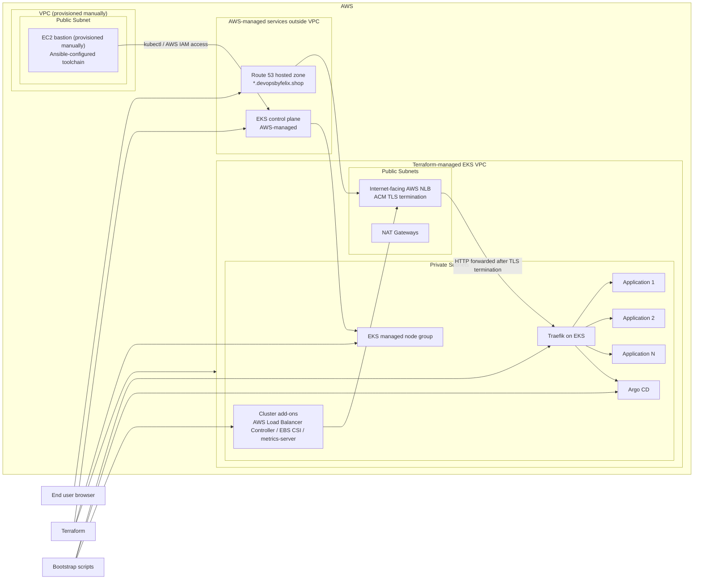

# AWS VPC + EKS Infrastructure for a GitOps Demo Platform

This repository provisions the **base AWS infrastructure** for my DevOps portfolio platform. It creates the VPC, Amazon EKS cluster, supporting AWS resources, and the initial cluster add-ons needed to host internet-facing applications.

The wider portfolio is split into three repositories:

- **infra** — AWS networking, EKS, and cluster bootstrap  
  `https://github.com/felixngwhuk/opentelemetry-devops-demo-infra`
- **web app** — application source code and container images  
  `https://github.com/felixngwhuk/opentelemetry-devops-demo`
- **gitops** — Argo CD application definitions and deployment manifests  
  `https://github.com/felixngwhuk/opentelemetry-devops-demo-gitops`

This repo focuses on the **platform foundation**: creating a reusable AWS environment and preparing the cluster for GitOps-based application delivery.

---

## Skills demonstrated by this repository

This repository demonstrates practical platform engineering work across:

- Terraform and Infrastructure as Code
- AWS networking and Amazon EKS
- Kubernetes cluster bootstrap
- Ingress and public traffic flow design
- GitOps platform enablement with Argo CD
- Operational automation and environment trade-offs
- GitHub Actions lifecycle orchestration for provisioning, bootstrap, teardown, and destroy workflows
- Ansible-based bastion/admin host configuration for repeatable EKS operations

---

## What this repository does

This project provisions and bootstraps:

- a custom **AWS VPC** with public and private subnets across multiple Availability Zones
- an **Amazon EKS** cluster with a managed node group
- **remote Terraform state** stored in S3
- cluster add-ons required for ingress, storage, metrics, and GitOps
- **Traefik** as the in-cluster ingress controller
- **Argo CD** as the GitOps entry point for application deployment
- GitHub Actions workflows that orchestrate Terraform apply, EKS bootstrap, add-on teardown, and infrastructure destroy
- Ansible automation for configuring an EC2 bastion/admin host with the tools needed to operate the EKS platform

The goal of this repository is not only to create an EKS cluster, but to show **how I structure the platform layer first** before deploying workloads.

---

## Why I took this approach

I split the platform into separate repositories because each layer has a different responsibility:

- the **infra repo** creates the AWS foundation
- the **web app repo** contains the application code and image build logic
- the **gitops repo** defines what should run in the cluster

I chose this structure because it makes the project easier to understand and closer to how responsibilities are often separated in real delivery workflows.

Within this infra repo, I used:

- **Terraform** to provision AWS resources consistently and repeatably
- **modular Terraform** so networking and EKS logic are easier to reason about and extend
- **bootstrap scripts** for cluster add-ons because some post-cluster steps are operational tasks rather than core infrastructure resources
- **Traefik** to provide simple hostname-based routing for multiple demo applications
- **Argo CD** so application deployment can be managed through GitOps rather than manual kubectl apply workflows
- **GitHub Actions** to provide a repeatable operator entry point for provisioning, bootstrapping, tearing down, and destroying the platform
- **Ansible** to configure a bastion/admin host with a pinned DevOps toolchain and EKS access helpers

---

## Skills and topics covered in detail

### Infrastructure as Code
I used Terraform to define the AWS foundation because I wanted the environment to be reproducible rather than manually configured. This includes:

- modular Terraform for **VPC** and **EKS**
- remote state stored in **S3**
- parameterised values for region, CIDR ranges, Availability Zones, Kubernetes version, and node sizing

### GitHub Actions lifecycle orchestration

I used GitHub Actions as the operator entry point for the infrastructure lifecycle so provisioning, EKS bootstrap, teardown, and destroy steps can run through repeatable workflows instead of ad hoc local commands. This includes:

- Terraform state and VPC/EKS apply workflows
- EKS cluster initialization through reusable bootstrap workflows
- chained provisioning that runs infrastructure creation before cluster initialization
- teardown and destroy workflows with typed confirmation gates
- `workflow_call`, `workflow_dispatch`, repository variables, and secrets for controlled runs

### AWS networking and platform setup
I created a dedicated VPC layout because I wanted public access to enter through load balancers while keeping worker nodes in private subnets. This includes:

- public and private subnets across multiple AZs
- Internet Gateway and NAT Gateways
- route tables and subnet tagging for Kubernetes load balancer integration
- EKS control plane logging support

### Kubernetes platform bootstrap
I added cluster bootstrap scripts because creating the cluster is only the first step; it still needs operational components before it can host applications. This includes:

- AWS Load Balancer Controller
- AWS EBS CSI Driver
- metrics-server
- Traefik
- Argo CD

### Bastion host configuration with Ansible

I added Ansible automation to configure an EC2 bastion/admin host as a repeatable operator workstation for the EKS platform. This includes:

- AWS CLI, kubectl, Terraform, eksctl, Helm, Git, and optional Docker installation
- pinned versions for kubectl, Terraform, eksctl, and Helm in `ansible/bastion/group_vars/bastion.yml`
- check-mode support and installed tool version checks
- Terraform checksum verification and idempotent Helm repository setup
- optional `eks_login_refresh` helper for kubeconfig refresh and cluster access checks on SSH login

### Ingress and public access design
I used Traefik plus an AWS network load balancer because I wanted a simple way to expose multiple applications through subdomains while keeping routing logic inside the cluster.

### Operational thinking
I added helper scripts and bootstrap logging because even for a demo environment, setup and teardown should be repeatable and easier to troubleshoot.

---

## Architecture overview

### High-level flow

1. Terraform provisions the VPC, subnets, routing, IAM roles, EKS cluster, and related AWS resources.
2. After the cluster is available, shell scripts install the required platform add-ons.
3. Traefik is exposed through a Kubernetes `Service` of type `LoadBalancer`.
4. AWS Load Balancer Controller provisions an **internet-facing Network Load Balancer (NLB)** for that service.
5. Public DNS for `*.devopsbyfelix.shop` is managed through **Route 53**.
6. A certificate is **issued by AWS ACM** for the domain.
7. **TLS termination happens on the NLB**, and the request is then forwarded to Traefik over HTTP.
8. Traefik applies hostname/path routing rules and forwards the request to the target application in the cluster.
9. Argo CD connects the cluster to the separate GitOps repository for application delivery.

### Architecture diagram


```mermaid
flowchart LR
    U[End user browser] --> D[Route 53 hosted zone\n*.devopsbyfelix.shop]
    D --> NLB[Internet-facing AWS NLB\nACM TLS termination]
    NLB -->|HTTP forwarded after TLS termination| T[Traefik on EKS]

    T --> A1[Application 1]
    T --> A2[Application 2]
    T --> A3[Application N]
    T --> ARGO[Argo CD]

    TF[Terraform] --> EKS_VPC
    TF --> EKSCP[EKS control plane\nAWS-managed]
    TF --> EKS

    SCRIPTS[Bootstrap scripts] --> T
    SCRIPTS --> ARGO
    SCRIPTS --> ADDONS[Cluster add-ons\nAWS Load Balancer Controller / EBS CSI / metrics-server]
    ADDONS --> NLB

    BASTION["EC2 bastion (provisioned manually)\nAnsible-configured toolchain"] -->|kubectl / AWS IAM access| EKSCP
    EKSCP --> EKS

    subgraph AWS
      direction LR

      subgraph OPS_VPC["VPC (provisioned manually)"]
        direction TB
        subgraph OPS_PUBLIC["Public Subnet"]
          BASTION
        end
      end

      subgraph AWS_MANAGED["AWS-managed services outside VPC"]
        direction TB
        D
        EKSCP
      end

      subgraph EKS_VPC["Terraform-managed EKS VPC"]
        direction TB
        subgraph PUBLIC["Public Subnets"]
          NLB
          NAT[NAT Gateways]
        end

        subgraph PRIVATE["Private Subnets"]
          EKS[EKS managed node group]
          ADDONS
          T
          A1
          A2
          A3
          ARGO
        end
      end
    end

    OPS_VPC ~~~ AWS_MANAGED
    AWS_MANAGED ~~~ EKS_VPC
```

---

## Repository structure

```text
.
├── .github/
│   └── workflows/
│       ├── terraform-state-s3-bucket-apply.yml
│       ├── terraform-vpc-eks-apply.yml
│       ├── terraform-vpc-eks-destroy.yml
│       ├── eks-cluster-init.yml
│       ├── eks-cluster-teardown.yml
│       ├── provision-infra-and-init-eks-cluster.yml
│       └── teardown-eks-cluster-and-destroy-infra.yml
├── aws-infra/
│   ├── terraform-state-s3-bucket/
│   │   ├── main.tf
│   │   └── outputs.tf
│   └── vpc-eks/
│       ├── main.tf
│       ├── variables.tf
│       ├── outputs.tf
│       └── modules/
│           ├── vpc/
│           │   ├── main.tf
│           │   ├── variables.tf
│           │   └── outputs.tf
│           └── eks/
│               ├── main.tf
│               ├── variables.tf
│               └── outputs.tf
├── ansible/
│   └── bastion/
│       ├── setup-bastion.yml
│       ├── group_vars/
│       │   └── bastion.yml
│       ├── inventory.ini.example
│       └── roles/
├── eks-cluster/
│   ├── eks-cluster-init.sh
│   ├── eks-cluster-teardown.sh
│   └── scripts/
│       ├── associate-iam-oidc-provider.sh
│       ├── create_iam_role_and_eks_serviceaccount.sh
│       ├── install_alb_controller.sh
│       ├── install_ebs_csi_driver.sh
│       ├── install_metrics_server.sh
│       ├── install_traefik.sh
│       ├── install_traefik_custom_values.yaml
│       ├── install_argocd.sh
│       ├── install_argocd_custom_values.yaml
│       ├── refresh_eks_cluster_connection.sh
│       └── traefik-pdb.yaml
└── utilities/
    └── scripts/
        ├── cleanup-unused-oidc-providers.sh
        └── purge_versioned_bucket.sh
```

---

## Key design decisions

### Decision: Use Terraform modules for VPC and EKS
**Why I did this:** I wanted the networking layer and the cluster layer to stay separate so the project is easier to navigate and change later.

### Decision: Keep worker nodes in private subnets
**Why I did this:** I wanted external traffic to enter through managed AWS load balancers rather than exposing Kubernetes nodes directly to the internet.

### Decision: Use S3 remote state with S3 lockfile-based locking
**Why I did this:** I wanted shared Terraform state in AWS instead of local state files, and I chose the S3 backend lockfile approach because it is the current direction for the S3 backend.

### Decision: Use Traefik as the in-cluster ingress controller
**Why I did this:** I wanted one routing layer inside Kubernetes that can expose multiple demo applications through subdomains without adding too much operational complexity.

### Decision: Use Argo CD for deployment bootstrap
**Why I did this:** I wanted the infrastructure layer and the application deployment layer to remain separate. Once the cluster is ready, application rollout can be managed from the GitOps repository instead of applying manifests manually.

### Decision: Terminate TLS on the AWS NLB
**Why I did this:** I wanted certificate management to stay on the AWS side while keeping Traefik focused on HTTP routing inside the cluster.

---

## Provisioned infrastructure

### 1) Terraform state bootstrap
The `terraform-state-s3-bucket` project creates the S3 bucket used for Terraform state storage.

I set this up first because remote state is part of the platform foundation, not something I wanted to add later after resources already existed.

### 2) AWS networking
The VPC module creates:

- the VPC
- public and private subnets
- Internet Gateway
- NAT Gateways
- public and private route tables
- Kubernetes-related subnet tags

I chose this layout because EKS needs clear separation between public entry points and private workload placement.

### 3) Amazon EKS
The EKS module creates:

- the EKS control plane
- IAM roles for cluster and nodes
- a managed node group
- control plane logging resources
- an EKS access entry that grants the bastion role cluster admin access

I used EKS managed nodes because they reduce the amount of low-level cluster administration needed for a demo platform.

The bastion host gets Kubernetes admin access through an EKS access entry for `EC2BastionAdminRole`. This requires the cluster authentication mode to be `API_AND_CONFIG_MAP` or `API`; this project defaults to `API_AND_CONFIG_MAP` so existing `aws-auth` ConfigMap behavior remains available.

### 4) Cluster bootstrap
The bootstrap scripts install and configure:

- AWS Load Balancer Controller
- AWS EBS CSI Driver
- metrics-server
- Traefik
- Argo CD

I handled these after cluster creation because they depend on a working Kubernetes API and, in some cases, on IAM/OIDC integration already being available.

---

## Public traffic flow

Applications on this platform are intended to be accessed using subdomains such as:

- `app.devopsbyfelix.shop`
- `argocd.devopsbyfelix.shop`
- `demo.devopsbyfelix.shop`

Traffic path:

```text
User -> Route 53 -> AWS NLB -> TLS terminates on the NLB -> Traefik -> target Kubernetes service -> application pod
```

Why I chose this design:

- I wanted **DNS** to stay in Route 53 because the project domain is hosted in AWS.
- I wanted **certificate issuance** to be handled by AWS ACM.
- I wanted **TLS termination** to happen at the NLB so Traefik can focus on in-cluster routing.
- I wanted **Traefik** to remain the central routing layer for multiple applications.

Important implementation detail:

- The AWS Load Balancer Controller provisions the external load balancer based on the Kubernetes `Service` annotations on Traefik.
- In this setup, that external load balancer is an **NLB**.
- Traefik then forwards the request to the correct workload inside the cluster.

---

## Tooling used

- **GitHub Actions** for orchestrating infrastructure lifecycle workflows
- **Ansible** for bastion/admin host configuration
- **Terraform** for AWS infrastructure provisioning
- **AWS CLI** for AWS access and cluster queries
- **kubectl** for Kubernetes management
- **eksctl** for OIDC and IAM service account operations
- **Helm** for installing cluster add-ons
- **Argo CD** for GitOps application delivery
- **Traefik** for ingress and routing

---

## Prerequisites

To run this project, you need:

- an AWS account
- a domain name that you can manage in DNS
- a GitHub account for forking this infra repo and the GitOps repo
- AWS credentials that can be stored as GitHub Actions secrets
- permission to create Route 53, ACM, IAM, S3, VPC, EKS, and load balancer resources

The main setup path uses GitHub Actions, so Terraform, kubectl, Helm, and eksctl are installed or run by the workflows. You only need those tools locally if you want to run the infrastructure or cluster bootstrap steps manually.

---

## Project setup

This setup assumes you own a domain name such as `abc.com` and want to expose applications through wildcard subdomains such as `app.abc.com`, `argocd.abc.com`, and `demo.abc.com`.

### 1) Create the bastion admin IAM role
Create an IAM role before running the infrastructure workflow. The Terraform EKS module grants this role cluster admin access through an EKS access entry.

Use these settings:

- Trusted entity type: `AWS Service`
- Use case: `EC2`
- Permission policy: `AmazonSSMManagedInstanceCore`
- Role name: `EC2BastionAdminRole`

Then add an inline policy:

- Policy name: `EKSBastionClusterAccess`
- Policy JSON:

```json
{
  "Version": "2012-10-17",
  "Statement": [
    {
      "Sid": "AllowEKSClusterDiscovery",
      "Effect": "Allow",
      "Action": [
        "eks:ListClusters",
        "eks:DescribeCluster"
      ],
      "Resource": "*"
    }
  ]
}
```

### Optional: Configure the bastion/admin host with Ansible

If you want to operate the EKS cluster from an EC2 bastion/admin host, use the Ansible project under `ansible/bastion`.

The intended flow is:

```bash
cd ansible/bastion
cp inventory.ini.example inventory.ini
# Edit inventory.ini with the bastion host, AWS Region, SSH user, and SSH key details.

ansible-playbook -i inventory.ini setup-bastion.yml --check
ansible-playbook -i inventory.ini setup-bastion.yml
```

The playbook installs the EKS administration toolchain and prints installed tool versions at the end of the run.

By default, the bastion configuration can enable an EKS kubeconfig refresh helper. This is useful when the bastion host is used as the main operator machine for checking cluster state, running kubectl commands, or debugging platform bootstrap issues.

Docker installation is controlled separately through `install_docker` in `group_vars/bastion.yml`, so the bastion host can stay lightweight unless container tooling is needed.

### 2) Create the Route 53 hosted zone
In Route 53, create a public hosted zone for your domain name.

Example:

- Domain name: `abc.com`
- Type: `Public hosted zone`

After the hosted zone is created, update your domain registrar to use the Route 53 name servers:

1. In the hosted zone, find the `NS` record.
2. Copy the name servers from the `Value/Route traffic to` column.
3. Go to your domain registrar, such as GoDaddy, and replace the domain's name servers with the Route 53 name servers.

### 3) Request the ACM wildcard certificate
In AWS Certificate Manager, request a public certificate for your wildcard domain.

Example:

- Certificate type: `Public certificate`
- Domain name: `*.abc.com`

Request the certificate in the same AWS region that you will use for the EKS cluster and Network Load Balancer.

After the certificate is created:

1. Open the certificate details page.
2. In the `Domains` section, choose `Create records in Route 53`.
3. Follow the AWS prompts to create the DNS validation records.
4. Wait until the certificate status changes to `Issued`.

### 4) Fork and configure the GitOps repo
Fork the GitOps repository to your own GitHub account:

```text
https://github.com/felixngwhuk/opentelemetry-devops-demo-gitops
```

In your fork, replace all references to `devopsbyfelix.shop` with your own domain name.

Example:

```text
abc.com
```

This should be done before the cluster bootstrap workflow runs because Argo CD installs its root application from the GitOps repo.

### 5) Fork and configure this infra repo
Fork this repository to your own GitHub account.

In your fork, add these GitHub Actions secrets:

| Secret | Description |
| --- | --- |
| `AWS_ACCESS_KEY_ID` | Access key ID for an IAM user with permissions to provision the demo infrastructure |
| `AWS_SECRET_ACCESS_KEY` | Secret access key for the same IAM user |

For a demo project, an admin IAM user is the simplest option. For production-style usage, prefer least-privilege permissions or GitHub OIDC instead of long-lived AWS access keys.

Then add these GitHub Actions variables:

| Variable | Description |
| --- | --- |
| `AWS_REGION` | AWS region to deploy into, for example `eu-west-2` |
| `EKS_CLUSTER_NAME` | Preferred EKS cluster name |
| `TERRAFORM_STATE_BUCKET` | Globally unique S3 bucket name for Terraform state |
| `AWS_LOAD_BALANCER_SSL_CERT_ARN` | ARN of the issued ACM wildcard certificate |
| `ARGOCD_BOOTSTRAP_REPO_URL` | Raw GitHub content base URL for your forked GitOps repo |

`ARGOCD_BOOTSTRAP_REPO_URL` must use the raw GitHub content URL, not the normal GitHub repository URL.

Example:

```text
https://raw.githubusercontent.com/<your-github-user>/opentelemetry-devops-demo-gitops
```

The cluster bootstrap script appends `/refs/heads/main/bootstrap/root-application.yaml` to this value when it installs the Argo CD root application.

### 6) Create the Terraform state bucket
Run this GitHub Actions workflow first:

```text
terraform-state-s3-bucket-apply
```

This creates the S3 bucket used by the Terraform backend.

### 7) Provision the infrastructure and bootstrap EKS
After the Terraform state bucket exists, run this GitHub Actions workflow:

```text
provision-infra-and-init-eks-cluster
```

This workflow provisions the VPC and EKS cluster, refreshes cluster access, installs the cluster add-ons, installs Traefik, and bootstraps Argo CD from your GitOps repo.

### 8) Create the wildcard DNS alias
After Traefik is installed, AWS Load Balancer Controller creates an internet-facing Network Load Balancer.

In your Route 53 hosted zone, create a wildcard `A` record:

- Record name: `*`
- Record type: `A`
- Alias: enabled
- Route traffic to: the Traefik Network Load Balancer

This step has to happen after the cluster bootstrap because the Traefik load balancer does not exist before then.

### Simplified setup flow
The full setup can be thought of as:

```text
Create IAM role
-> Create Route 53 hosted zone and ACM certificate
-> Fork and configure GitOps repo
-> Fork and configure infra repo
-> Run terraform-state-s3-bucket-apply
-> Run provision-infra-and-init-eks-cluster
-> Add wildcard Route 53 alias to the Traefik NLB
```

---

## Demo Compromises vs Production

### 1) Single demo cluster for multiple workloads
**What I am simplifying:** Using one cluster to host several demo applications.  
**Why:** Lower cost and simpler management.  
**Risk introduced:** Lower isolation between workloads and environments.  
**What production would look like:** Separate environments, tighter tenancy boundaries, and stronger policy controls.

### 2) Static ACM certificate reference in Traefik values
**What I am simplifying:** The ACM certificate ARN is currently referenced statically in the Traefik values file.  
**Why:** It is the fastest way to get the NLB listener configured during a demo.  
**Risk introduced:** Less portability between accounts or regions, and more manual change when the certificate changes.  
**What production would look like:** Inject the ARN dynamically from Terraform outputs, templating, or environment-specific configuration.

---

## Related repositories

- Infra: `https://github.com/felixngwhuk/opentelemetry-devops-demo-infra`
- Web app: `https://github.com/felixngwhuk/opentelemetry-devops-demo`
- GitOps: `https://github.com/felixngwhuk/opentelemetry-devops-demo-gitops`
